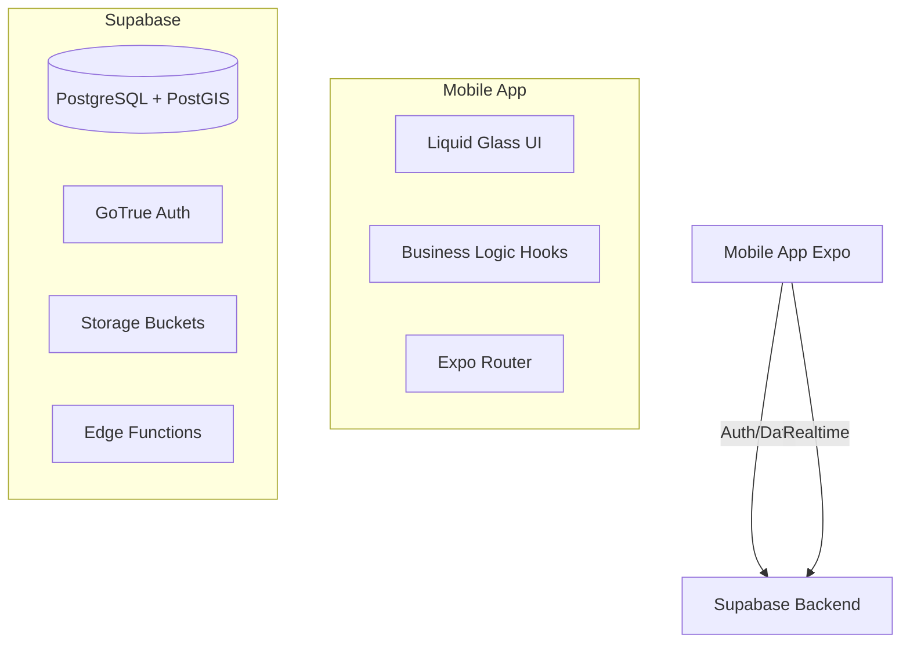

# Ezriya Platform - Master Documentation

**Version:** 2.1.1 (Development Build)  
**Last Updated:** February 2026  
**Platform:** React Native (Expo) + Supabase  
**License:** Proprietary

---

## 1. Executive Summary & Vision

**Ezriya** is a modern, mobile-first real estate marketplace designed to streamline the connection between buyers, sellers, and agents.

Built on an **Intent-Based Matching Engine**, it simplifies property discovery through a streamlined "Feed" interface. While the platform's long-term vision is an "AI-Driven Hybrid Ecosystem," the current implementation focuses on a robust, beautiful **Foundation for Matching and Transaction Management**.

> [!NOTE]
> **Honest Status**: The app currently functions as a rigorous **"Match-and-Chat" platform**. It uses **ARCHIVE/MATCH buttons** (no swipe gestures) for precise control. Advanced AI features (The "Conductor", Visual DNA Quizzes) are in the **Research/Roadmap** phase.

### Key Concepts
-   **Buyers**: Search for properties by creating explicit "Intents" (budget, location, preferences).
-   **Sellers**: List properties and review interested buyers. "Seller Interest Badges" prioritize high-probability deals.
-   **Agents**: Represent buyers or sellers in transactions.
-   **Matching**: A strict double-opt-in system. A match is created **ONLY** when both parties select **MATCH**.
-   **Deal Rooms**: Collaborative spaces automatically generated upon matching.

---

## 2. Technical Architecture

### High-Level Architecture


### Technology Stack
| Category | Technology | Version | Usage |
| :--- | :--- | :--- | :--- |
| **Frontend** | **React Native** | 0.81.5 | Core framework. |
| | **Expo** | ~54.0.33 | Runtime and build toolchain. |
| | **Expo Router** | ~6.0.23 | File-based routing. |
| | **TypeScript** | ~5.8.3 | Type safety. |
| **UI** | **Liquid Glass** | Custom | Custom glassmorphism system using `expo-blur`. |
| | **Reanimated** | ~4.1.1 | 120fps physics-based animations. |
| **Backend** | **Supabase** | v2 | BaaS (DB, Auth, API). |
| | **PostgreSQL** | 15+ | Database with PostGIS. |
| | **Edge Functions** | Deno | Serverless logic (matchmaking). |

### Project Structure
```text
ezriya-platform-main/
├── apps/mobile/
│   ├── app/                 # Expo Router Screens
│   │   ├── (auth)/          # Login, Role Select, Verify
│   │   ├── (buyer)/         # Feed, Matches, Inbox, Profile
│   │   ├── (seller)/        # Leads, Listings, Matches
│   │   └── (pro)/           # Agent Dashboard
│   ├── components/          # Reusable UI (GlassSurface, LiquidGlassButton)
│   ├── lib/
│   │   ├── hooks/           # Business Logic (useFeed, useSwipe, useDealRoom)
│   │   └── supabaseClient.ts
│   └── src/ui/              # Design Tokens & Core UI Primitives
├── supabase/
│   ├── migrations/          # SQL Schema
│   └── functions/           # Edge Functions
└── packages/shared/         # Shared Types
```

---

## 3. Core Features & Implementation Details

### A. The Matching Engine (`MATCHING_FLOW.md`)

The platform uses a **two-sided matching system**.

#### The Flow
1.  **Buyer Swipes YES**: 
    -   Location: `feed.tsx`
    -   Action: Creates a record in `swipes` table with `is_request: true`.
    -   Result: No match yet. Waiting for seller.
2.  **Seller Reviews Request**:
    -   Location: `leads.tsx`
    -   Sellers see "Requests" (buyers who swiped YES) prioritized with a badge.
3.  **Seller Swipes YES**: 
    -   Action: Creates a record in `swipes`.
    -   **Edge Function Trigger**: Checks for mutual YES.
    -   Result: **Match Created**.

#### Database Records Created on Match
When a match occurs, the system automatically generates:
1.  **Match Record**: Links Buyer, Seller, and Listing.
2.  **Deal Room**: A dedicated collaborative space (`deal_rooms`).
3.  **Participants**: Adds both users to `deal_participants`.
4.  **Conversation**: Initializes a chat thread.
5.  **Default Tasks**: Autofills the deal room with appropriate tasks (e.g., "Schedule Inspection").

### B. Task Management System (`TASK_MANAGEMENT_FEATURES.md`)

Deal rooms come equipped with a comprehensive task management system to guide the transaction.

#### Structure
-   **Categories**: Pre-Offer, Due Diligence, Financing, Closing.
-   **Features**:
    -   **Comments**: Participants can discuss specific tasks (`task_comments`).
    -   **Attachments**: File uploads per task (`task_attachments`).
    -   **State**: Todo -> Doing -> Done.

#### Default Task Lists (Auto-Generated)
-   **Pre-Offer**: Review Property, Schedule Showing, Prepare Offer.
-   **Due Diligence**: Inspections (Home, Pest), Title Report, Appraisal.
-   **Closing**: Final Walkthrough, Wire Funds, Transfer Utilities.

### C. Liquid Glass UI System (`LIQUID_GLASS_UI_UPDATE.md`)

A comprehensive update to the design language focusing on "Ultra-Fluid Liquid Glassmorphism".

#### Design Tokens
-   **Border Radius**: Highly organic (`sm: 16`, `md: 20`, `3xl: 40`).
-   **Glass Opacity**: Ultra-transparent (`0.08` to `0.25`) for a premium feel.
-   **Blur Intensity**: High (`60` to `100`) for depth.
-   **Shadows**: Colored shadows (Purple `#6A1B9A`) instead of standard black.

#### Key Components
-   `GlassSurface`: Base container with multi-layer blur.
-   `LiquidGlassCard`: Specialized card for listings with shimmer overlays.
-   `LiquidGlassButton`: Buttons with liquid borders and glow effects.

---

## 4. Database Schema

### Core Tables
-   **profiles**: Users (`role`, `verification_level`).
-   **listings**: Properties (`status`, `price`, `lat/lng`).
-   **buyer_intents**: Search criteria (`budget`, `areas`, `must_haves`).
-   **swipes**: Actions (`actor_id`, `target_id`, `direction`).
-   **matches**: Successful connections (`match_score`).

### Transaction Tables
-   **deal_rooms**: Workspace for matches.
-   **deal_participants**: Users in a deal.
-   **tasks**: Individual steps in the deal.
-   **task_comments**: Discussion on tasks.
-   **conversations** & **messages**: Chat history.

### Row Level Security (RLS)
-   **Strict Access Control**: Users can only see data they own or are part of (e.g., participants in a deal room).
-   **Insert Policies**: Required for creating matches and deal rooms (see Troubleshooting).

---

## 5. Troubleshooting & Guides

### Fixing "No Match" Issues (`FIX_MATCHING.md`)

**Problem**: Buyer and Seller both swiped YES, but no match appears.
**Root Cause**: Often missing RLS `INSERT` policies on the `matches` or `deal_rooms` tables.

**Solution**:
Ensure these policies exist in Supabase:
```sql
-- Allow Authenticated users to insert matches (triggered by Edge Function or Client fallback)
CREATE POLICY "Authenticated users can create matches" ON matches FOR INSERT
WITH CHECK (auth.uid() = buyer_id OR auth.uid() = seller_id);

-- Allow creating deal rooms
CREATE POLICY "Users can create deal rooms..." ON deal_rooms FOR INSERT
WITH CHECK (EXISTS (SELECT 1 FROM matches WHERE matches.id = match_id ...));
```

### Debugging Steps
1.  **Check Swipes**: Are there records in `swipes` for both users?
2.  **Check Status**: Is the listing `active`? Is the buyer intent `active`?
3.  **Check Logs**: Look for "Match Created" or RLS permission errors in the console.

---

## 6. Future Roadmap

-   **AI Conductor**: Autonomous agent for scheduling and task automation.
-   **Visual "DNA" Quiz**: Gamified preference collection.
-   **Market Intelligence**: Computer-vision analysis of listing photos.

---

## 7. Web Platform Features (Next.js)
*Consolidated from `apps/web/FEATURES.md`*

### Current Implementation
The web application is a modern **Single Page Application (SPA)** built on Next.js 15, optimized for performance and "Liquid Glass" aesthetics.

-   **Framework**: [Next.js 15](https://nextjs.org/) (App Router, React Server Components)
-   **State Management**: [Zustand](https://zustand-demo.pmnd.rs/) (Global store for Buyer/Seller flows)
-   **Animation**: [Framer Motion](https://www.framer.com/motion/) & [React Three Fiber](https://docs.pmnd.rs/react-three-fiber) (3D Landing Page Scene)

### Core Web Capabilities
1.  **3D Landing Page**: `CityScene.tsx` renders an interactive 3D environment.
2.  **Buyer Experience (`/buy`)**:
    -   **DNA Quiz**: Multi-step wizard (`QuizContainer.tsx`) for preference collection.
    -   **AI Integration**: Simulated "Global AI Assistant" (`GlobalAiChat.tsx`) ready for real API integration.
3.  **Aesthetic Engine**: Shared "Liquid Glass" design system implemented via custom CSS variables and Tailwind.

